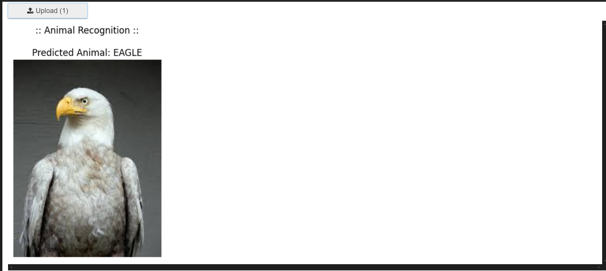

# 🐾 Multi-Class Animal Recognition For Wildlife Conservation


## 📌 Overview
A deep learning-based image classification project that identifies multiple animal species using **Transfer Learning** with **MobileNetV2**. The project focuses on wildlife recognition through data augmentation, model optimization, and an interactive prediction interface.

---

## 🚀 Features
- Multi-class animal image classification
- Transfer Learning using MobileNetV2
- Data augmentation for improved generalization
- Early stopping to prevent overfitting
- Interactive image upload and prediction
- Classification reports and performance visualization

---

## 🛠️ Tech Stack

| Technology | Purpose |
|---|---|
| Python | Programming Language |
| TensorFlow & Keras | Model Building & Training |
| MobileNetV2 | Transfer Learning |
| Scikit-learn | Evaluation Metrics |
| Matplotlib | Visualization |
| ImageDataGenerator | Data Augmentation |
| IPython Widgets | Interactive UI |
| KaggleHub | Dataset Access |

---

## 🧠 Workflow

```text
Dataset Collection
        ↓
Data Preprocessing
        ↓
Data Augmentation
        ↓
MobileNetV2 Transfer Learning
        ↓
Model Training & Evaluation
        ↓
Real-Time Animal Prediction
```

---

## ⚙️ Model Training
- Pre-trained **MobileNetV2** used as the base model
- Added dense and dropout layers for classification
- Optimizer: **Adam**
- Loss Function: **Categorical Crossentropy**
- Early stopping applied to avoid overtraining

---

## 📊 Evaluation Metrics
- Accuracy
- Precision
- Recall
- F1-Score
- Classification Report

---

## 🖼️ Sample Output



**Prediction Example:** `EAGLE`

---

## ▶️ Installation

Clone the repository:

```bash
git clone https://github.com/KimmiKumari07/Animal_Recognition.git
cd Animal_Recognition
```

```bash
pip install tensorflow keras scikit-learn matplotlib kagglehub ipywidgets
```

Run the project:

```bash
jupyter notebook
```

---

## 🌍 Applications
- Wildlife Conservation
- Biodiversity Monitoring
- Animal Recognition Systems
- Educational & Research Purposes

---

## 🤝 Conclusion
This project demonstrates the effective use of deep learning and transfer learning techniques for multi-class animal image classification. By combining robust model training, data augmentation, and an interactive prediction interface, the system provides an efficient and scalable solution for wildlife recognition.

---

## 📄 License
This project is licensed under the MIT License.

---

## ⭐ Support
If you found this project useful, give it a ⭐ on GitHub.
